# 1. Taking medicines

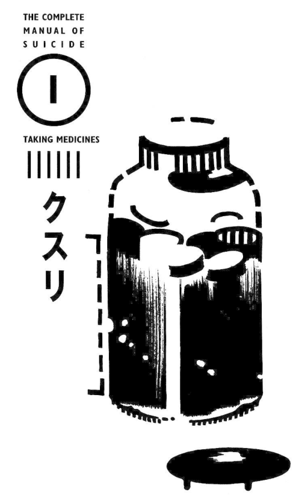

| | |
| --- | --- |
| Pain | －－－－－ |
| Trouble | ▼▼▼▼▼ |
| Ugliness | ▼▽▽▽▽ |
| Ripple[^ripple] | ▼▽▽▽▽ |
| Impact[^impact] | ▼▽▽▽▽ |
| Lethality | ▼▽▽▽▽ |

[^ripple]: 迷惑, how annoying it would be for other people to clean up if you die by this method.

[^impact]: インパクト, which literally means "impact". However, I couldn't figure out what it is supposed to mean. Does it mean "the visual impact of the corpse appearance on others"? But then, why do we have a separate category for "Ugliness" and "Impact"? For most methods, these two rows are pretty much the same, except drowning which has "Ugliness" 4/5, but "Impact" 1/5. It is hard to understand.

If you can manage it, overdose is the best way to commit suicide. However, there are so many cases of failures, and excessive preparation time is a major problem. The degree of pain varies depending on the drug.

Scattered on the table are capsules and tablets in various colors such as red, yellow, and blue, or a small pile of snow-white powder. When you swallow these, you will slowly fall asleep and never wake up again. This is death as an extended bout of a peaceful sleep, and so it is the most ideal method of suicide, only reachable through drugs.

Certain drugs control the mind. The brain is the system control device responsible for the self-organization of the human body. Whether it is respiratory function or heart beating, the functions of life-sustaining activities are controlled by the brain. It should be noted here that the technique used to destroy the entire "self" system by gradually losing coordination through drugs is a kind of do-it-yourself lobotomy method.

A substance that cannot ever be fatal cannot be medicine.

No matter what kind of drug, there is an "effective dose", a "toxic dose" and a "lethal dose". Some experts also say, "The dose makes the poison." Any drug can kill. It's just that the gap between the effective dose and the lethal dose is typically quite large. To reach the lethal dose, a considerable amount must be swallowed, a difficult task. With modern pharmaceutical science, this gap has become wider and wider. In other words, they are safer drugs. What I want to describe here are those where the gap is narrow.

However, the problem lies in the "lethal dose". The doses quoted in this book are the lethal doses of drugs recorded in various literatures, but it also varies from across literature, and the range is also very large. At the same time, the lethal dose varies greatly depending on the individual's constitution, and whether they take the medicine regularly. Therefore, there are some people who take a large dose and survive, but other people who take a small dose but die.

The "lethal dose" that should determine the boundary between life and death sometimes fails to cause death due to different doses, varying qualities, and individual differences. So some researchers say that if you really want to die, just take three times the lethal dose. So we see that the "lethal dose" does not mean "the dose that kills". This book temporarily refers to the midpoint between the minimum and maximum lethal dosages quoted in the literature (and unless otherwise stated, all dosages are for adults). This is only a general standard. This ambiguity about the lethal dose not only point to the blurry line between life and death, but is also the biggest reason that overdose suicide is difficult.

However, there are a few more words to say here. You will never die just by slicing your wrist, but if you take the drugs listed here, you will actually die. If you just want to have a taste of suicide (which is not a bad thing), it is better to cut your wrist.

## Note

### Increase the absorption of digestive organs to avoid nausea

The most important thing to avoid is vomiting out the medication you have taken. Death from overdose is basically acute chemical poisoning. Just imagine drinking alcohol. Of course, alcohol poisoning can be fatal. Often there are cases of college student dying from alcohol poisoning. However, usually when the body can no longer bear it, it will vomit it out. It's just swapping alcohol for drugs. It is natural to vomit due to a large overdose. So, getting the right amount is very difficult.

Of course, there are ways to prevent vomiting, which simply enhance absorption by the digestive organs, just like allopathic treatment. There is no way to deal with vomiting due to physiological rejection reaction. In short, you can only try to take it towards the "lethal dose", even if it's just one more tablet.

### You will not die by overdosing on Halcyon[^halcyon]

Another thing you should pay attention to is to understand the "lethal dose" before taking drugs. There are many drugs that can kill. For example, the sleeping pill Hazard is becoming a hot topic nowadays. Drowsiness comes quickly and memory may be lost after taking it, so it seems very dangerous, but it is a very safe drug. A 27-year-old woman who drank alcohol and swallowed eighty tablets of Halcyon got up like a sleepwalker after falling asleep, said to her parents, "... go to Lawson ..."[^lawson] and then fell down. He regained consciousness the next day after being sent to the hospital, and the results of the examination were normal. Just looking dangerous won't kill anyone.

[^lawson]: Lawson, Inc. (株式会社ローソン, Kabushiki gaisha Rōson) is a convenience store franchise chain in Japan. The store originated in the United States, but exists today as a Japanese company based in Shinagawa, Tokyo.

This book does not introduce drugs whose lethal dose is unknown. Actions without a plan will not only fail but also cause unnecessary pain. A housewife who swallowed potassium cyanate scratched her chest all night and was found to be a bloody mess.

By the way, many of the rumors about drug suicide are false. People often say that it will leave serious sequelae to the internal organs or brain that will last a lifetime, but judging from the drugs listed in this book that have an effect on the nervous system, some doctors say that almost all of them have no such side effects.

There are also "anti-suicide advocates" who claim that health insurance does not cover the cost of suicide treatment, so it costs a huge amount of money, but this is also untrue. A 26-year-old woman was admitted to the hospital after swallowing 20 tablets and 20 packets of powdered sedatives whose ingredients and dosages are unknown, but which are considered to be the most powerful drugs in hospitals. She was in a coma for two days, but she used her insurance card to pay for her medical bills. Therefore, it is also important to pay attention not to be deceived by lies.

[^halcyon]: Halcyon, a Japanese trademark for sleeping pills with triazolam as the active ingredient. They are generally light blue tablets, each containing 0.25 mg of triazolam.

## Preparation: Intravenous injection

First, there are various strategies to prevent vomiting. The easiest way is to place the drug on something like a green wave and bake it with fire to melt it, or dissolve it with hot water to become an aqueous solution, and then inject it into the vein with a syringe. In this case, of course there will be no vomiting, but it will have a greater effect than gastrointestinal absorption and require much less. If air is mixed into the syringe, air embolism may occur in the cerebral blood vessels and lead to death. There are also cases of death caused by shock caused by foreign matter other than blood mixed into blood vessels. There will be considerable pain in the blood vessels due to the mixing of foreign matter. In the case of multiple injections, if the pain is severe, you can apply a cold compress to the arm. In short, you need to think of something.

## Note

### the Last Supper

For those who want to die by taking medicine instead of injections, it is necessary to adjust the state of their stomach in advance. In order to absorb the drug more quickly and effectively cause acute poisoning, food should not be left in the stomach. But if you are too fasting, you will have an allergic reaction and vomit. It is difficult to control the proportion.

About an hour before deciding to commit suicide, you should drink a cup of black tea, eat a piece of toast, and take some anti-intoxicants. Tablets should be crushed in advance and put into a grinder to form a powder. The capsule should be removed, leaving the powder, or placed in hot water to dissolve into a liquid. Then mix the medicine into pudding or yogurt, add some honey, and swallow it quickly. But some experts say mixing the drug in pudding or yogurt won't speed up absorption. Perhaps it's better to think of it as a way to aid swallowing.

### Drink some wine at the same time

Drinking some wine at the same time is a must. It is said that alcohol has a mutually reinforcing effect on drugs that have an effect on the central nervous system. It can accelerate the dissolution rate of any drug, and the effect can be increased by 50% when used together. In addition to wine, it is best to prepare a few more drinks.

Furthermore, you must choose a place that others cannot find, and at least a place where you can stay alone within eight hours. For example, a hotel is the most suitable. If someone discovers it within a few hours, it becomes a suicide attempt and requires repeated enemas. A 25-year-old woman who was given an enema for a suicide attempt said, "If I had known it would be so painful, I would not have committed suicide." (However, she also said, "Maybe I will commit suicide again.")

Once the preparations are complete, let's start introducing the drugs.

## Over-the-counter medicine

The drugs sold over-the-counter are typically not very toxic. Professional books say: "\[OTC drugs\] are almost never fatal if taken in large amounts in a single dose." Although this statement cannot be considered correct, it is indeed difficult to commit suicide by taking OTC drugs. As mentioned above, drugs have various amounts that produce effects and cause poisoning. Therefore, medicines that are produced with low toxicity while maintaining a certain distance from the poisoning amount are popular medicines. Therefore, it is sold in general pharmacies. However, the basic points of suicide pills are that they are "easy to obtain" and "you will fall asleep after taking them." If you can't get it, even introducing it is meaningless. It is necessary to know that it is difficult to cause death by taking popular medicines, but in the past, professional books said that "it is almost impossible to cause death." In other words, it is not 100% impossible, and this exception is introduced here.

\[

Translator's note: The letters appearing in the tables, such as `(A)`, are citation keys. I did not translate those, but here is the citations page.

\]

### (1) Psychoactive drugs

#### Risuron S (リスロンS)

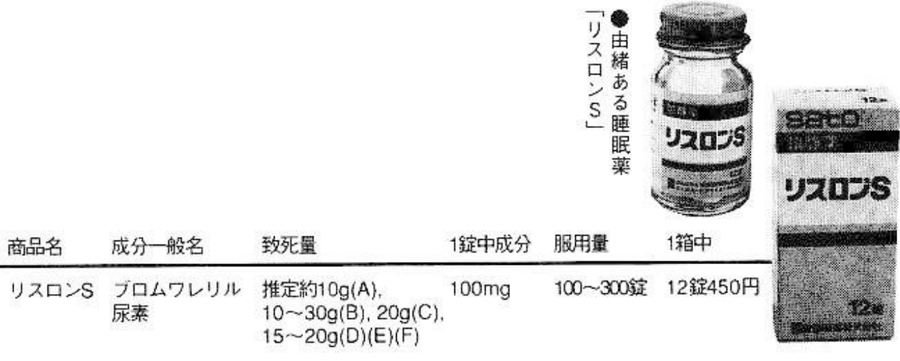

| Product Name | Standard name | Lethal Dose | Ingredients in One Tablet | Dose (Lethal) | One Box of Servings |
| - | - | - | - | - | - |
| Risuron S | Bromvalerylurea | Estimated 10g(A)  10～30g(B)  20g(C)   15～20g( D,E,F) | 100mg | 100～300 pieces | 12 pieces/450 yen |

The "standard name" refers to the name of the active ingredient in the drug. The "product name" is the trademarked names for trademarked products produced by specific pharmaceutical companies. For example, "Aspirin" is a product name for drugs with the active substance of "acetylsalicylic acid".

In the 1950s and 1960s after the war, there was a second sleeping pill suicide craze. Mainly young people in their twenties, the number of people who commit suicide by taking sleeping pills greatly exceeds the number of people who hang themselves. Bromovalerylurea was sold under the brand name "Burobarin" (ブロバリン), and was the main drug for the second suicide craze. At the time when Ryūnosuke Akutagawa committed suicide by taking sleeping pills in 1926, causing the first suicide craze, bromovalerylurea was sold under the name "Calmotin" (カルモチン), and widely used. Osamu Dazai also used Calmotin to make several lover's double suicide attempts. Therefore, it is clear that bromovalerylurea is a long-standing suicide drug in Japan.

Currently, bromovalerylurea is designated as a "drug that must be used under a doctor's instruction" and cannot be purchased without a doctor's prescription. "Risuron S" (リスロンS) (Sato Pharmaceutical Co., Ltd.) sold on the market has the same ingredients and dosage as Burobarin. Obviously this is legal. Because the amount of bromovalerylurea in each tablet is less than 500mg and can be sold. These are 8mm-diameter tablets, white in color and bitter in taste.

When the conditions are ripe, as long as a lethal dose is taken, the central nervous system will fall under the drugs' effect, (the excitatory powers of the brain and spinal cord nerves will fail), and consciousness will be lost quickly. Death will occur mainly due to respiratory arrest in about an hour. Someone died after taking 50 tablets of burobarin (Case study 2), but it is still appropriate to take 200 tablets. 200 tablets is enough to fill both hands. If this is all that's needed amount, then there is no need to mix it with yogurt (Case study 1).

In addition, medicines that contain 100 mg of bromovalerylurea in one tablet include "Muurumin" (ム－ルミン, by Kobayashi Pharmaceutical Co., Ltd.), "Day and Night" (Taisho Pharmaceutical Co., Ltd.), etc. "Risuron S" is made purely from bromovalerylurea, but others contain some caffeine and other ingredients. Because it contains other active ingredients, the total dosage increases, and the possibility of vomiting increases.

In addition, the acetaminophen, mentioned later, is often sold in tablets that also contain 150 mg of bromovalerylurea. If you take 100 to 200 tablets equivalent to the lethal dose of bromovalerylurea, you will also reach the lethal dose zone of acetaminophen. This is double the lethal dose and even more dangerous.

##### How to buy

The instruction manual for "Risuron S" says that it is "a drug that has a sedative effect on anxiety and tension." You can buy it by simply repeating the symptoms to the pharmacy, but the biggest problem is how to buy 10 to 20 boxes of that. Most pharmacies would have not that much stock, and pharmaceutical companies don't typically sell that much to pharmacies, so you can't buy enough all at once. In some cases, the product may not be sold due to the judgment of the pharmacy. Pharmacies near major stations generally have supplies. You can look for about five of them and bought them every half month, and get twenty boxes in two months. You can take 2 to 3 tablets of this medicine every day, and since there are only 12 tablets in the box, so it is not surprising to buy it every ten days. However, in order to prevent abuse, pharmacies sometimes do not sell it, or ask about symptoms, or refer you to the hospital. A pharmacy staff member said: "I won't sell to anyone who looks wrong." In this case, you can explain that "I don't want to go to the doctor." or "It would be terrible if my colleagues (classmates) know that I are not mentally healthy." The same goes for drug abuse. If you can't find a pharmacy that sells it, call the pharmaceutical company and they will tell you which ones sell it.

#### Atarax-P (アタラックスP)

| Product Name | Ingredients | Lethal Dose | Ingredients in One Tablet | Dose (Lethal) | One Box of Servings |
| - | - | - | - | - | - |
| Atarax-P | Hydroxylammonium chloride | Estimated 25～250mg/kg | 25mg | 60～600 pills (weight 60kg) | 20 pills/1500 yen |

This medicine is sold in most pharmacies. It is very easy to buy 60 to 600 capsules, that is, 3 to 30 boxes. As mentioned before, "get it, take it and fall asleep" is the condition for sleeping suicide pills, and this "Atarax-P" (produced by Pfizer) is the drug with the best conditions. The lethal dose is 25 to 250 mg per kilogram of body weight. The range is too large and it is a vague guess. Therefore, a person weighing 60 kilograms can take 600 tablets.

Just placing 600 small green capsules in front of you will give you an illusion that "it looks like a lot", but the ingredient in one capsule are only 20mg. There is yellow powder in the capsule, and when you take them out and pour together, it is only a quarter of the size of a small bowl. This amount is easy to take without mixing it in yogurt.

Hydroxylammonium chloride has the effect of inhibiting the central nervous system and stabilizing the autonomic nervous system. When taken in large amounts, sleepiness, fatigue, dizziness, and eventually death due to respiratory arrest may occur. Be sure to take it with alcohol. The inhibitory effect on the central nervous system will be enhanced, and the effect will be better if the body is cooled at this time.

Drugs with the exact same ingredients include "Jisuron P" (ジスロンP, Imperial Chemical Co., Ltd.) and "Bobusuuru" (ボブス－ル, Kato Suisatsudo Co., Ltd.). Atarax-P is available in packs of 100 tablets.

However, a 40-year-old woman who took 100 tablets of Atarax-P and drank a bottle of beer and a glass of whiskey lost consciousness and vomited 17 hours later. She was found and sent to the hospital. She recovered and was discharged two days later. All in all, think twice and take more.

### (2) Cough suppressants

#### Paburon-S (パブロンS), Aneton (アネトン)

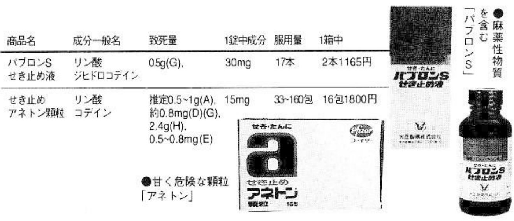

| Product Name | Ingredients | Lethal Dose | Ingredients in One Tablet | Dose (Lethal) | One Box of Servings |
| - | - | - | - | - | - |
| Paburon-S Cough Liquid | Codeine Dihydrophosphate | 0.5g(G) | 30mg | 117 bottles | 2 bottles/1165 yen |
| Aneton Granules | Codeine Phosphate | Estimated 0.5g～1g(A)   About 0.8g(D,G)   2.4g(H)   0.5～0.8mg(E) | 15mg | 33～160 packs | 16 packs/1800 yen |

In the 1980s, there was a popular game of "drinking cough drops in one gulp and then jumping like crazy". This is because cough drops contain anesthetic substances such as codeine, which acts on the cough center in the brain to relieve coughs, and ephedrine, which dilates the trachea. Codeine is a component of opium, and although the lethal dose of ephedrine is unknown, it is a raw material for stimulants, so it is very dangerous. It should be banned, but it will not stop coughing if you don't use it. Therefore, most of the cough suppressants sold now contain these two ingredients.

"Paburon-S" (Taisho Pharmaceutical) is also one of this type of drugs. In the 1980s, "Buron liquid" (SS Pharmaceuticals) was widely used, but now this medicine does not contain ephedrine, so here is dihydrocodeine phosphate, which has an almost identical structure to codeine. 30 mg and "Paburon" of dimethylephedrine hydrochloride (methyl ephedrine), the sister ingredient of ephedrine. Codeine phosphate can cause drowsiness when taken in large amounts, while ephedrine has a wakefulness effect. Overall, it is not so much sleep as it is a strong excitatory effect, leading to increased heart rate, accelerated breathing and death due to circulatory insufficiency. In addition, cough suppressants containing 30 mg of dihydrocodeine include "New Deni Cough Liquid" and "New Dihydrocodeine Cough Liquid" (Kowa).

The content of dimethylephedrine hydrochloride in "Aneton Granules" (by Pfizer) is 10 mg. In the book *Final Exit*, it's stated that codeine lethal dose is 2.4 g, so just believe it and take more than 240 granules, which is just a small bowl in terms of quantity. An expert's opinion is: "Things mixed with yogurt and the like" have white particles and a sweet taste.

### (3) Antiemetics

#### Rakkumoa (ラックモア)

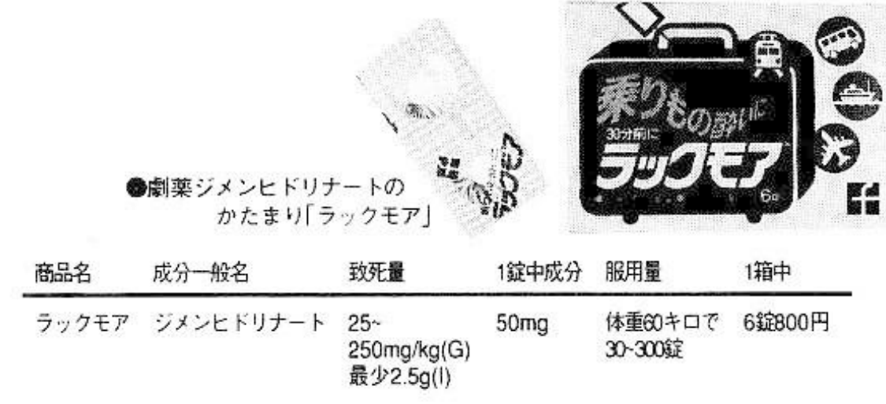

| Product Name | Ingredients | Lethal Dose | Ingredients in One Tablet | Dose (Lethal) | One Box of Servings |
| - | - | - | - | - | - |
| Rakkumoa | Dimenhydrinate | 25～250mg/kg(A)   At least 2.5g(I) | 50mg | 30～300 pills (60kg) | 6 pills/800 yen |

Antiemetics, surprisingly, contain many dangerous ingredients. After a 24-year-old woman took 7.5g of dimenhydrinate in order to have an abortion, she developed vomiting, dizziness, convulsions, fell into a coma, and died due to respiratory insufficiency 90 minutes later. "Rakkumoa" (Fujisawa Pharmaceutical Co., Ltd.) contains pyridoxine hydrochloride 7 mg and caffeine anhydrous 14 mg in addition to dimenhydrinate, making it easier to obtain than pure dimenhydrinate medicine. This is a slightly larger tablet with a three-layer structure of white, blue and white. Drugs containing 50mg of Dimenhydrinate include "Carax" (Kyoei Pharmaceutical), "Dimenhydrinate", "Moder" (Moder Pharmaceutical), "Drive Soft" (Choseido Pharmaceutical), etc. There are several types, and they are also sold in pharmacies. In addition, if you can die by taking at least 30 tablets, it is perfect for suicide.

The problem with taking this drug is sleeping well. As mentioned earlier, this drug affects the central nervous system and causes respiratory arrest. Side effects include drowsiness, headache, etc. However, since it is not a psychotropic drug, it cannot fall asleep quickly. If you must sleep, you can use sleeping pills on the market together.

However, there are also cases of 20-year-old and 22-year-old men who took 800mg of dimenhydrinate and experienced hallucinations but did not die.

#### Travelmin Senior (トラベルミン シニア)

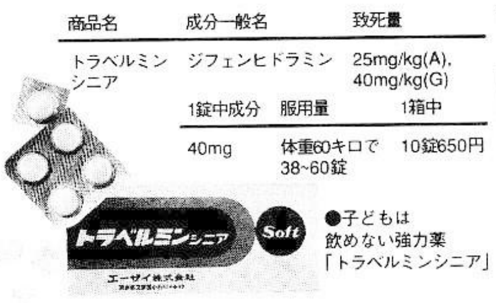

| Product Name | Ingredients | Lethal Dose | Ingredients in One Tablet | Dose (Lethal) | One Box of Servings |
| - | - | - | - | - | - |
| Travelmin Senior | Diphenhydramine | 25mg/kg(A)   45mg/kg(G) | 40mg | 38～60 capsules (60kg) | 10 capsules/650 yen |

"Can the famous 'Travelmin Senior' also kill people?" Some people may have questions. The ingredients of "Travelmin Senior" are 40 mg of diphenhydramine and 26 mg of diprophylline. There are not many other ingredients, and the dangerous ingredient diphenhydramine accounts for the largest proportion. There are also many others that contain ingredients that prevent drowsiness such as caffeine. Diphenhydramine acts as an antihistamine, causing a mixture of central nervous system depression and excitement symptoms. Produces severe brain stimulation and severe loss of consciousness. However, antihistamines have a hypnotic effect. It is forbidden to drive a vehicle after taking them. If you take them in large amounts, you will fall asleep.

#### Senpaa (センパア)

| Product Name | Ingredients | Lethal Dose | Ingredients in One Tablet | Dose (Lethal) | One Box of Servings |
| - | - | - | - | - | - |
| Senpaa | Scopolamine hydrobromide | 50mg(A)   5～10mg(D) | 0.25mg | 200 capsules | 6 capsules/777 yen |

The advantage of anti-vomiting and anti-sickness medicine is that people think that "No one would commit suicide using that kind of medicine." When you go to buy something, you can say, "I want to buy more medicine to prevent motion sickness because I'm going on a long trip." and the pharmacy won't be suspicious. Senpaa (Taisho Pharmaceutical) only has six tablets in a box. If you want to buy 200 tablets, you only need 33 boxes. There is no need to worry.

Scopolamine hydrobromide has a parasympathetic nervous system inhibitory effect and can inhibit breathing if taken in large amounts. Side effects include drowsiness, confusion, hallucinations, difficulty swallowing, etc. It is questionable whether you will fall asleep immediately after taking it. There are many drugs containing scopolamine hydrobromide to prevent motion sickness. Among the drugs currently available on the market, Senpaa has the highest content of scopolamine and does not contain other unnecessary ingredients. It is a large tablet with a diameter of one centimeter. Take 200 tablets and break them to a fine powder. It is not bitter.

### (4) Others

#### Taishou Tonpuku (大正トンプク), Ron Sampo Capsule A (ロン三宝カプセルA)

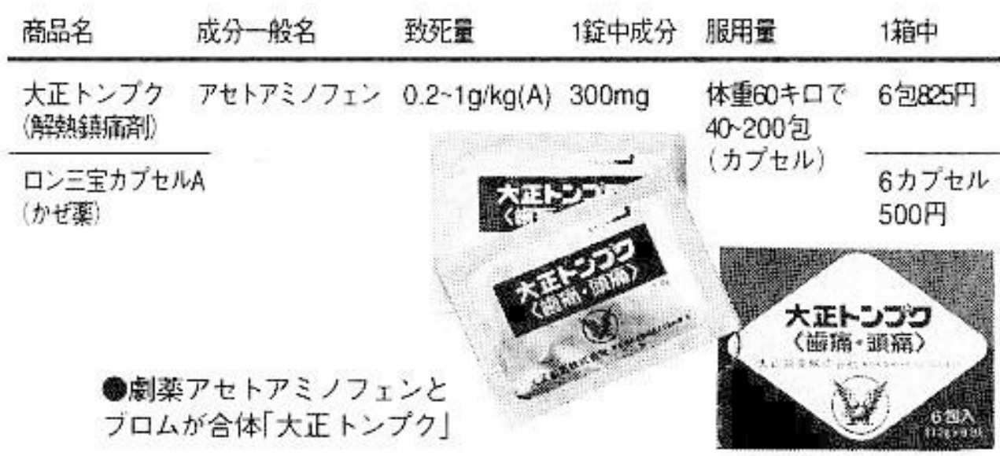

| Product Name | Ingredients | Lethal Dose | Ingredients in One Tablet | Dose (Lethal) | One Box of Servings |
| - | - | - | - | - | - |
| Taisho Tonpuku  Ron Sampo Capsule A | Acetaminophen 8 | 0.2～1g/kg | 300mg | 40～200 packs (60kg) | 6 packs/825 yen  6 capsules/500 yen |

"Taisho Tonpuku" (Taisho Pharmaceutical) and "Ron Sampo Capsules A" (Sampo Pharmaceutical) contain 300 mg of acetaminophen, which has a sedative and antipyretic effect. Ingesting large amounts can cause drowsiness, dizziness, headache, nausea, vomiting, and drowsiness. In the end, it endangers the liver and leads to death. It cannot be said that it is a sleeping pill. However, one pack of Taisho Tonpuku contains 200mg of bromovalerylurea, so it is easy to fall asleep. The precautions for the drug also state that it "may cause drowsiness" and it is forbidden to drive a car or operate machinery after taking it. It is a small white granule with a bitter taste but a cooling sensation in the mouth after taking it.

Analgesics such as "Noushin Arakusu" also contain 300mg of acetaminophen in one bag. There are many other complexes, but this one has the advantage of "you can buy a lot at once". If you want to list acetaminophen-containing detoxification and analgesics, there are too many to mention. There are many on the market, so you might as well buy them in lethal doses. For example, a 49-year-old woman took 30 tablets of of "SEDES A" (80 mg of acetaminophen, 100 mg of bromovalerylurea, 200 mg of ethylsulfamide, 25 mg of anhydrous caffeine) caused liver and kidney failure. After sixteen days of excitement and lethargy, she died due to respiratory arrest. The woman who died after taking only 30 tablets (acetaminophen 2.4g) was lucky. Among the ingredients in "SEDES A", the one that causes the most severe side effects is acetaminophen. The "New SEDES A" currently sold (Shionogi Pharmaceuticals) use allylisopropylacetylurea 10 30mg and caffeine 40mg instead of bromovalerylurea, and the other ingredients remain unchanged.

> 8 Acetaminophen: over-the-counter analgesic and fever-reducing drug. Taking more than 7.5 g/day or 150 mg/kg may cause liver damage.
>
> 9 Ethenzamide: salicylic acid antipyretic and analgesic. The analgesic effect is similar to that of salicylic acid derivatives such as aspirin, but side effects can cause liver and kidney damage. The LD50 when administered orally to mice is 549 mg/kg
>
> 10 Allylisopropylacetylurea: sedative drug that has a depressive effect on the central nervous system and is addictive.

#### Estalon Mocha (エスタロンモカ), aspirin

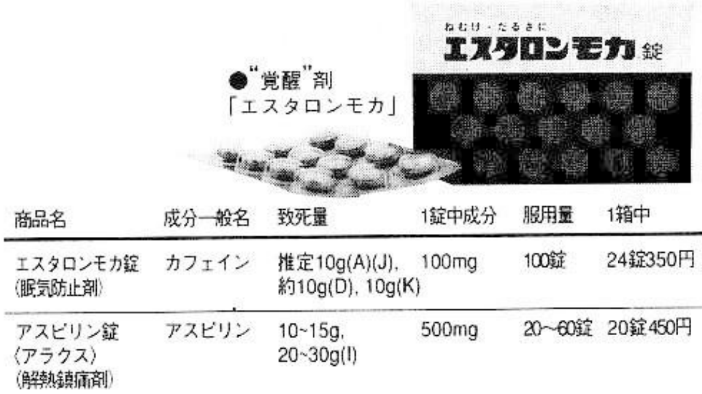

| Product Name | Ingredients | Lethal Dose | Ingredients in One Tablet | Dose (Lethal) | One Box of Servings |
| - | - | - | - | - | - |
| Estalon Mocha | Caffeine | About 10g (A, D, J, K) | 100mg | 100 pieces | 24 pieces/450 yen |
| Aspirin | Aspirin | 10～15g   20～30g(I) | 500mg | 20～60 pieces | 20 pieces/450 yen |

Some people think that "drinking coffee all the time" and not caring much about caffeine is bad. Caffeine stimulates the vasomotor center and respiratory center in the brain, strengthens the muscle contraction of the heart, and is a highly stimulating agent. Drinking large amounts can cause excitement, increased blood pressure, ventricular fibrillation (a phenomenon in which the ventricles in the lower part of the heart contract), cardiopulmonary arrest, and death. Aspirin stimulates the central nervous system and metabolic system such as the respiratory center, leading to rapid breathing, metabolic abnormalities, high fever, death due to respiratory failure or shock, and damage to the kidneys. Both have stimulant effects and will never cause sleep after taking them, but they are introduced because they are easy to obtain and can cause death in small amounts. It is an unforgettable medicine for people who want to die peacefully. For example, a 21-year-old female student who took 100 tablets (50 g) of 500 mg aspirin experienced various symptoms such as fatigue, nausea, excitement, shortness of breath, and lethargy. About nineteen hours later, she suffered from respiratory failure, collapsed, and died. Judging from the above examples, the time from taking aspirin to death is quite short.

Caffeine and aspirin, which were introduced because they contain the least unnecessary ingredients, are commercialized in large quantities, such as "Estalon Mocha" (エスタロンモカ, coffee-colored tablets, extremely bitter taste) and aspirin tablets (used to be a trademark for acetylsalicylic acid, but has long fallen into generic use). There are "Coffee Soft Tablets" (エカ－フェソフト錠, produced by Eezai エ－ザイ), "Coffee Cool Tablets" (カフェク－ル, produced by Arakusu アラクス) and other medicines that prevent dozing off. For aspirin, there are antipyretic analgesics with aspirin as the main ingredient, such as "Grandol" (グランド－ル, Fujisawa Pharmaceutical Co., Ltd.) and "New Grelan A" (新グレランA, Takeda Pharmaceutical Co., Ltd.).

### Case study 1: A young salesman who posted an article to a newspaper announcing his suicide

On 1956-08-02, at around 10 in the evening, a movie theater in Mejiro District, Tokyo, was showing two movies in succession. The receptionist noticed that a young man was still sleeping, so she planned to wake him up, but found that the man was already cold. He slowly swallowed 200 tablets of Brovarin[^brovarin] and 30 tablets of Adorm[^adorm] while drinking alcohol. After being rushed to the hospital immediately, he slept for a whole day and night, and died early on the 4th.

He was born in Tokyo and was 23 years old when he died. He dropped out of Tokyo University of Fisheries and worked for a pharmaceutical company for four and a half years, mainly in packaging and delivery. His brother is also a pharmacist at a pharmaceutical company, and he probably got the lethal dose of the drug and the method of taking it from there.

On July 28 of the previous month, on the same day that he resigned from the pharmaceutical company due to "personal reasons", he started promoting "buy now, pay in installments later" in a department store. However, he was extremely dissatisfied with the company's policy that if the target performance was not achieved, all commissions would be owned by the company. On August 1, the day before his suicide, he sent a letter to the *Asahi Shimbun*'s submission column that read "That day, when I leave this world, I loudly call out this company's illegal practices." A letter, in other words, that announced his own death.

He wrote in his suicide note to the director of the department store, "Before I decided to do something that I had already decided on, I just encountered the department store by chance. Though the law of the jungle existed in this society, I do not blame its existence on the low-level people in the organization..." This shows that he did not commit suicide in order to accuse the company of injustice. He was a cheerful man with a philosophical side. The motive behind this young man's suicide, who once locked himself in a room to write a detective novel, remains unknown.

[^brovarin]: ブロバリン, the Japanese generic name for a drug with active ingredient bromovalerylurea. It came into Japanese market in 1915.

[^adorm]: アドルム, a drug with active ingredient cyclobarbital calcium. In Japan, cyclobarbital was available only as cyclobarbital calcium in powder or tablet form (Adorm, Shionogi & Co., Osaka, Japan) until it was banned in 1973.

#### Check: the cause of death

What needs to be tested here is not the strange behavior he took before death, but that he swallowed 200 tablets of Brovarin and 30 tablets of Adorm. He took a large amount of sleeping pills such as barbituric acid without vomiting them up, and completed his suicide. Normally, swallowing such a large number of tablets would result in vomiting them out. This is one of the shortcomings of committing suicide by taking poison. He probably swallowed them bit by bit during the two hours or more of the movie's release, and proved that if you take in little bits and swallow, you won't spit it out.

Brovarin was sold only in units of 100 mg. He swallowed 20 grams, which was enough to reach a lethal dose of 10 -- 30 grams. It is said that if you drink alcohol with these sleeping pills, the effect will be ten times greater. He probably heard this from his brother.

### Case study 2: A student who took 50 tablets of Brovarin and left a "record of death"

In May 1972, a 20-year-old student slipped from his chair in his room and died. There is a suicide note on the table in his room, a brand new notebook titled "The Last Moments", which begins with "I did not escape from this society due to the influence of the so-called misanthropy. The reason why I want to disappear now is because I feel that now It was the right time that made me decide to commit suicide."

What's even more strange is that he wrote in detail the process from swallowing the drug until he lost consciousness in his college notebook.

"It is now 1972-05-19, 10:07 in the afternoon. I swallowed 50 Brovarin tablets two or three minutes ago. I don't know how many minutes or hours later I will fall asleep and be with this Farewell to society, but I will observe my own death until the last moment... 10:15, and I don't want to sleep at all. I turned on the radio and listened for a while, then turned it off. I wanted to stay calm but I was still excited, as usual. The music I used to love sounds so boring today. I want to review my life carefully... (what follows are five sheets of description of his parents and friends)... 11:30. I have been yawning since just now. I see the last moment coming. But I want to observe the mood of death until the last moment, so I keep telling myself to persist. I don't know when my body will be found, but I want to see my own desire It keeps coming up. ... Now, 12 o'clock, and I, 5 minutes"

The note ended here, and it was about this time that he lost consciousness.

#### Check: the cause of death

Brovarin 50 tablets are equivalent to 5 grams of bromovalerylurea, which is much lower than the lethal dose, but I don't think the young man is lying, so I know that he will die even if he swallows such a large amount. At the same time, I also learned that swallowing 50 tablets of Brovarin will slowly increase sleepiness, and you will not wake up after falling asleep for about two hours. There was no pain at all until he lost consciousness, and his consciousness was very clear. Of course, this will vary greatly depending on your physical strength and health. If you fall down immediately, you will probably fall asleep in a shorter time.

His suicide can really be said to be an "experiment." Regarding leaving a record, he wrote: "To die without leaving anything behind can easily be misunderstood as the result of melancholy that is often the case at my age. I do not want to be misunderstood in any way, so I am here calmly Leave me to look carefully at my own evidence." However, we have no idea of ​​his motive for committing suicide, so we can only think that he died "to try out how he would feel when he died."

No matter what, the record I wrote while holding the pen until I was about to lose consciousness is extremely precious. After the last "five minutes", I should probably write "Then it's time to fall asleep."

In addition, as an example of taking bromovalerylurea, a 22-year-old woman who swallowed 50 tablets of five kinds of drugs containing bromovalerylurea, was found and treated twelve hours after taking it, and continued in a semi-asleep state. Ten days later, she died of heart failure and complicated nephritis.

Also, two 15-year-old female students who had swallowed 100 tablets of Brovarin (thus, 10 grams per student) were found staggering while walking and were taken to the hospital by ambulance. They regained consciousness five hours later and fully recovered.

## Controlled substances

For drugs that may be abused as recreational drugs or used to commit suicide, the Ministry of Health and Welfare defines them as potent drugs, poisons, indicated drugs, designated pharmaceuticals, etc., and does not allow the general public to obtain them. What I want to introduce here are these "restricted pharmaceuticals". Just because it's not easy to obtain doesn't mean it's impossible to get. Maybe someone already has a prescription, so I'm introducing it here.

[Translator's note: As the levels of control differs by locale and time, I did not translate the level of control given in the book, which is only true for Japan in 1990s. Check your local laws and regulations.]

### Serushin, Diazepam, Sonakon

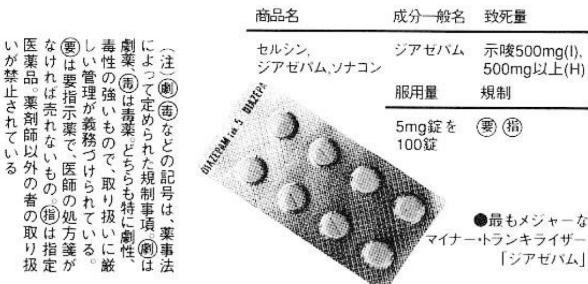

| Trade Name | Ingredients | Lethal Dose | Dose (Lethal) |
| - | - | - | - |
| Serushin, Diazepam, Sonakon | Diazepam | Hint 500mg (J)   More than 500mg (H) | More than 100 pills |

Recently, some psychiatrists have been prescribing drugs indiscriminately. When you open the door to mental medicine and tell the doctor that you "can't sleep" or "feel restless", there is a high possibility that an anti-anxiety drug such as "Serushin" or "Diazepam" will be prescribed immediately. Sometimes internal medicine will also prescribe this. After getting an anti-anxiety prescription from a psychiatrist, you say "It didn't work." and ask for a change of medication. Because doctors also need to try which one is more suitable for patients.

However, just because doctors prescribe Benzodiazepam series drugs first, it also shows that they are very safe. Even if you are lucky enough to get such a prescription, the effect is small and the distance between it and the lethal dose is too large. In order to get the lethal dose, you have to go to the hospital frequently. The prescribed amount is no more than 15 mg per day, so at least a month's worth of medicine needs to be accumulated. Furthermore, doctors had worried that the drugs they prescribed could be accumulated and used for suicide. Precisely because it is easy to obtain, it is not suitable for suicide. There are two cases where two patients who swallowed an estimated 450 to 500 mg of Diazepam recovered within 48 hours.

Although the brand names such as "Serenamin" and "Kurashina" are different, their active ingredients are all Diazepams. Sometimes when you don't understand what medicine the doctor prescribes, you can refer to books such as "Doctor's Guide to Prescription Medicines".

### Antidepressants

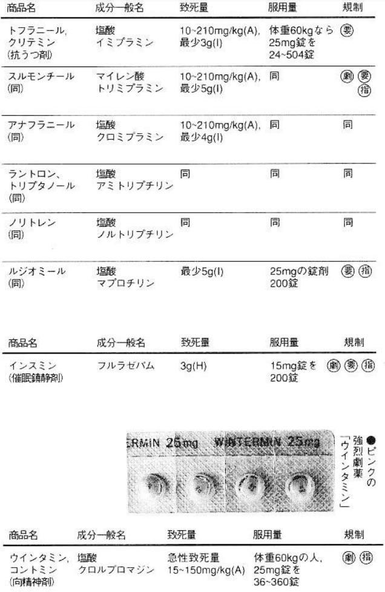

Antidepressant drugs such as Tofranil are suitable for those conditions where anti-anxiety drugs do not work, such as extreme depression and insomnia. It's harder to get than anti-anxiety medications, but you can get a prescription if you tell your doctor you're having trouble sleeping, the anti-anxiety medications aren't working, etc. It can even mean you want to commit suicide. If you really fall into a depressed state, you will sometimes be cheerful and sometimes lively. Once the medication is discontinued, you will return to the original state.

[Translator's note: The following table is really boring. I did not check the table carefully.]

<table>
    <thead>
        <tr>
            <th>Product name</th>
            <th>Ingredients</th>
            <th>Lethal dose</th>
            <th>Dosage (fatal)</th>
            <th>Restrictions</th>
        </tr>
    </thead>
    <tbody>
        <tr>
            <td>Tofranil   Critemin</td>
            <td>Imipramine hydrochloride16</td>
            <td>10～210mg/kg(A)   At least 3g(I)</td>
            <td rowspan="5">25mg tablets (60kg) 24～504 tablets</td>
            <td>To</td>
        </tr>
        <tr>
            <td>Surmontil (same)</td>
            <td>Trimipramine maleate17</td>
            <td rowspan="4">10～210mg/kg(A)
At least 5g(I)</td>
            <td rowspan="4">Drama, point, point</td>
        </tr>
        <tr>
            <td>Anafranil (same)</td>
            <td>Clomipramine hydrochloride18</td>
        </tr>
        <tr>
            <td>Lantrone Tryptanol (same)</td>
            <td>Amitriptyline hydrochloride19</td>
        </tr>
        <tr>
            <td>Noritoren (same)</td>
            <td>Nortriptyline hydrochloride20</td>
        </tr>
        <tr>
            <td>Ludiomir (same)</td>
            <td>Maprotiline hydrochloride21</td>
            <td>Minimum 5g(I)</td>
            <td>25mg tablet/200 tablets</td>
            <td>To, refers to</td>
        </tr>
    </tbody>
</table>

This is a list of antidepressants that all have similar properties. Taking large amounts can cause headaches, dizziness, and drowsiness. Sometimes it can cause confusion, hallucinations, and usually fall asleep quickly. But cramps in the hands and feet are a common poisoning effect. Although it is not thought to cause damage to internal organs, there are examples of effects on the liver. If CNS depressants and alcohol are used together, the effect will be enhanced.

> 16 Imipramine hydrochloride, an antidepressant.
>
> 17 Malinic acid トリミプラミン: an antidepressant, the side effects may cause confusion, hallucinations, disturbance of consciousness, reduced level of consciousness, loss of consciousness, shock, etc.
>
> 18 Clomipramine, an antidepressant.
>
> 19 Amitriptyline: Amitriptyline, one of the earliest tricyclic antidepressants, may increase the risk of suicide after taking it.
>
> 20 Nortriptyline, one of the earliest tricyclic antidepressants.
>
> 21 Maprotiline: Maprotiline, a tetracyclic antidepressant, is used to treat depression. Taking it may increase the risk of suicide.

### Insumin (インスミン)

| Trade Name | Ingredients | Lethal Dose | Dose (Lethal) |
| - | - | - | - |
| Insumin | Flurazepam | 3g(H) | 15mg tablets/200 tablets |

Although "Insumin" is not an anti-anxiety agent or an anti-depressant, it is commonly prescribed by doctors as a sleeping pill. Of course, taking a large amount will create a state of excitement, but due to the suppression of the central nervous system, you will soon fall asleep and die due to respiratory arrest. Likewise, the combined use of alcohol and other central nervous system depressant drugs can increase its effects.

### Wintermin, Kontomin (コントミン)

Very powerful sedatives. Most people will feel intense drowsiness soon after taking just one tablet. A 21-year-old college student fell asleep after taking a tablet of "Wintermin" during a lecture. When he woke up, the next class had begun. In other words, he was unaware of the movements of the people around him and slept for more than five hours.

| Trade Name | Ingredients | Lethal Dose | Dose (Lethal) |
| - | - | - | - |
| Wintermin Kontomin | Chlorpromazine hydrochloride | Acute lethal dose 15～150mg/kg(A) | 25mg tablets/36～360 tablets |

"Wintermin" and "Kontomin" are powerful sedatives. This drug is used for patients with severe symptoms, not neurosis but schizophrenia, so it is more difficult to obtain, but it is very lethal. This drug also depresses the central nervous system, and the cause of death is respiratory arrest. It is important to swallow a lethal amount of medication before sleepiness sets in.

However, there are also examples of people being rescued after swallowing 9.75 g. Symptoms of poisoning are: persistent high fever, disturbance of consciousness, difficulty breathing, circulatory collapse, and dehydration, followed by death due to acute renal failure.

### Barbital, Isumital, and others

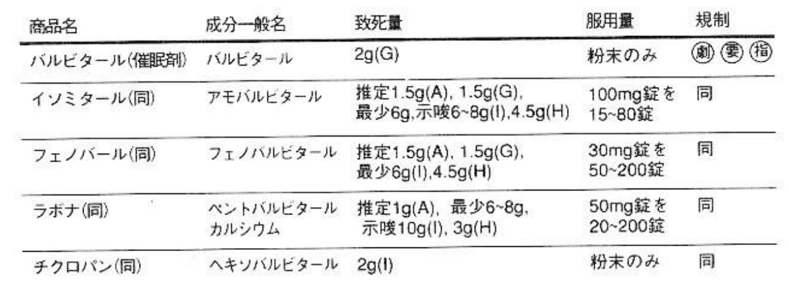

These will kill you if you ingest them. The range between the effective dose and the lethal dose is extremely small. It is said that if you take even a small amount, you will fall asleep and die. The European and American Euthanasia Association also strongly recommends this drug. However, it is 100% impossible to obtain. Because it was from a long time ago, it is almost not used in Japan at present. Even if it is prescribed, it is only used by people with extremely severe symptoms. However, it is possible to obtain it overseas, so I will introduce it here.

<table>
    <thead>
        <tr>
            <th>Product name</th>
            <th>Ingredients</th>
            <th>Lethal dose</th>
            <th>Dosage (fatal)</th>
            <th>Restrictions</th>
        </tr>
    </thead>
    <tbody>
        <tr>
            <td>Barbiturates</td>
            <td>Barbital</td>
            <td>2g(G)</td>
            <td>Powder only</td>
            <td rowspan="5">Drama, point, point</td>
        </tr>
        <tr>
            <td>Immitar (same)</td>
            <td>Amobarbital</td>
            <td rowspan="2">Inferred 1.5g(A) 1.5g(G) At least 6g, implying 6~8g(I) 4.5g(H)</td>
            <td>100mg tablet/15～80 tablets</td>
        </tr>
        <tr>
            <td>phenobal (same)</td>
            <td>Phenobarbital</td>
            <td>30mg tablets/50～200 tablets</td>
        </tr>
        <tr>
            <td>Labona (same)</td>
            <td>Pentobarbital Calcium</td>
            <td>Inferred 1g(A) At least 6~8g, implying 10g(I) 3g(H)</td>
            <td>50mg tablet/50～200 pieces</td>
        </tr>
        <tr>
            <td>Ciclopane (same)</td>
            <td>Hexobarbital</td>
            <td>2g(I)</td>
            <td>Powder only</td>
        </tr>
    </tbody>
</table>

These are sleeping pills belonging to the barbiturates family, extremely dangerous drugs that can cause heart and respiratory arrest and death if taken in large amounts. Symptoms of poisoning include headache, convulsions, mental confusion, etc. If you take a large amount, you will suddenly fall into coma. If you can get your hands on it, there is no better suicidal drug than this.

If you plan to buy overseas, you should remember the generic name because the product name is not universal. It is said that the regulations in the Netherlands are relatively loose.

However, there are also the following examples. A fifty-one-year-old doctor estimated that he swallowed 20g of phenobarbital powder and fell into a coma for four days. Later, he regained consciousness through artificial dialysis. After continuing to have delusions, fantasies, and excitement, after a period of Month, I was discharged from the hospital without any mental impairment.

For such drugs, which are almost unavailable and whose lethal doses are known, a list is provided at the end of this chapter for reference.

## Recreational drugs

Some recreational drugs are the most lethal. Compared with other pharmaceuticals, their lethal dose can be very small. However, there are some reservations about recommending those as suicide drugs.

I have no idea how to get it. Even if someone told me that "there are clubs frequented by foreigners where you can get it", it is usually impossible to know which club it is and who will sell it to me. Even if you get it, how many impurities will it contain? Besides, I have no idea what kind of recreational drugs I could get there.

At the same time, depending on whether the body is used to it, the toxic effects and lethal doses vary greatly. Originally, the lethal dose varies from person to person, and it is even more obvious when it comes to recreational drugs. Chronic poisoning is not suitable for the general lethal dose (some records say it is ten times). There is no other way to kill this kind of death except ingesting a large amount. This means that recreational drugs are not suitable for planned suicide. Because of this, what follows is solely for the eyes of those who can get it, or already have it, and know its ingredients.

### Stimulants: amphetamine, methamphetamine

| Ingredients | Lethal Dose |
|-|-|
| Amphetamine Metaphetamine| Estimated 120mg (A) 120mg (intravenous injection) (L) |

There was once a question: "Should I stop stimulants, or should I stop my life?" The correct answer should be "I should stop my life by stimulants."

Immediately after the Second World War, the drug that started a stimulant craze was commercially sold under the name "Hiropon".[^hiropon] Today it is called "Shabu" or "Speed" and is widely used by gangsters and even club youths, and it is this recreational drugs that still occupies the throne of the Japanese recreational drugs industry. Amphetamine (amphetamine) is mainly used in Europe and the United States, and the inventor of methamphetamine (Hiropon) is a Japanese, and it later became widely spread around the world and became Japan's representative recreational drugs. It might as well be said that Hiropon means "love of work" in Greek.

[^hiropon]:
    During the Second World War hiropon was given by the military to fighter pilots and the signal corps in order to help them stay awake and alert. After 1945, the large military stockpiles of methamphetamine found their way onto the black market. With society in chaos, drug abuse spread rapidly and a hiropon epidemic emerged. The introduction of a comprehensive anti-drug package in the mid-1950s, including stricter laws, resulted in that abuse having been almost totally eradicated by 1957.

    Edström, Bert. "The forgotten success story: Japan and the methamphetamine problem." Japan Forum. Vol. 27. No. 4. Routledge, 2015.

Stimulants stimulate the central nervous system, especially the brain, improving concentration and desire for activity. When a lethal dose of metafetamine was injected intravenously for the first time, the patient's heart beat rapidly within seconds to tens of seconds, autonomic nervous system abnormalities occurred, sweating, deep and accelerated breathing, dilated pupils, and death due to circulatory organ failure. Sometimes it can cause brain hemorrhage. The effect is reduced if consumed, so it must be injected intravenously.

However, for people who have become accustomed to it, even taking 0.5 to 1g a day will not cause death. A 27-year-old woman fell into a coma after taking 2g of methamphetamine. Her pupils were dilated and her facial muscles twitched violently, so she was admitted to the hospital. She recovered and was discharged eleven days later. It can be considered that she can tolerate the drug very well. On the contrary, there are also cases of death after taking only 1.5mg. I don't think anyone will try it, but avoid using it together with calming substances like "Serushin" or "Wintermin", because the effect will be reduced.

### Cocaine

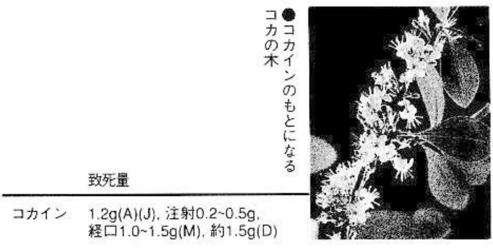

| Ingredients | Lethal Dose |
|-|-|
| Cocaine | 1.2g (A) (J), injection 0.2 ~ 0.5g, oral 1.0 ~ 1.5g (M), about 1.5g (D) |

According to a 1984 survey conducted by American Women's Magazine, one-third of women under the age of 25 have used cocaine. This is an American narcotic drug in which interest is still on the rise. There have been no reports of deaths from cocaine. The lethal dose is much higher than that of other recreational drugs, making it less suitable for suicide.

It has a stimulating effect on the central nervous system and makes breathing deeper. Its pharmacological effects are considered to be roughly the same as stimulants. Usually the powder is inhaled through the nose, but the effect is much greater when given intravenously. It is said that, in general, for acute poisoning, death will occur within three hours after use. The state of consciousness in the near-Ugliness is the same as that of drugs other than hallucinogens. Even if you have a slight headache, you are conscious and will think calmly, "This is not good" and "I can't die like this." Regular users will not die even if they take 1.5 to 2 g per day.

Cocaine is the main component of coca tree leaves. If you want to buy it overseas, you should buy it in Colombia, the country of origin.

### Depressants: opium, morphine, heroin

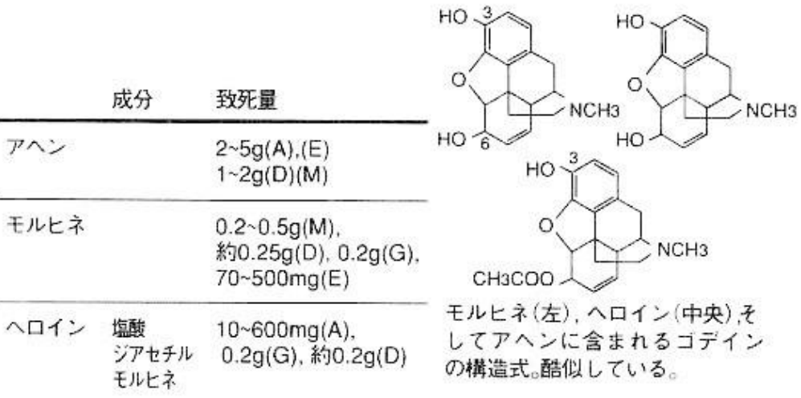

<table>
    <thead>
        <tr>
            <th>Depressants</th>
            <th>Ingredients</th>
            <th>Lethal dose</th>
        </tr>
    </thead>
    <tbody>
        <tr>
            <td>Opium</td>
            <td rowspan="3">Mainly morphine alkaloids</td>
            <td>2～5g(A)(E),1～2g(D)(M)</td>
        </tr>
        <tr>
            <td>Morphine</td>
            <td>0.2～0.5g(M), about 0.25g(D), 0.2g(G)</td>
        </tr>
        <tr>
            <td>Heroin</td>
            <td>10～600mg(A),0.2g(G),about 0.2g(D)</td>
        </tr>
    </tbody>
</table>

Generally speaking, these three types of drugs are considered to be completely different, but in fact they have the same ancestor.

Opium is made from the emulsion obtained from the unripe peel of opium poppy and dried into powder. It is composed of more than 20 kinds of plant salts such as codeine. Among them, morphine, which has the largest content and accounts for 4 to 20%, becomes the main component, and heroin is the most powerful one after chemical treatment. Of course, the order of potency is heroin, morphine, and opium. The strength of heroin is considered to be ten times that of morphine. The poisoning effect is roughly the same, and if it can be obtained, heroin is the most reliable in causing death.

Contrary to cocaine, these stimulants can inhibit the central nervous system and cause a trance of pleasure. They are called a series of depressants. If excessive inhalation or injection occurs, dizziness, nausea and vomiting will occur within tens of seconds, blood pressure and body temperature will gradually drop, breathing will be suppressed, and death will occur due to respiratory arrest within 6 to 12 hours after falling into coma. Kidney failure from heroin is fatal. Rumor has it that the punk rocker Sid Vicious died from heroin overdose.

Thailand, Myanmar, Laos, etc. are all major producing areas, and of course they are easily available.

### Cocktail: speedball

Mixing it with other recreational drugs will create a synergistic effect and be more lethal, such as sleeping pills. It is generally believed that if you mix drugs that inhibit the central nervous system, it will be more likely to cause death. However, in the world of recreational drugs, the inhibitory series of cocaine and The stimulating series of heroin, commonly known as "fast balls", are particularly dangerous when mixed and inhaled or injected. The use of this type of mixture will cause a cross between stimulating and inhibiting effects on the central nervous system. The heart will beat violently and then suddenly feel like it is about to stop. This phenomenon occurs repeatedly within a few seconds. The cause of death was cardiac arrest, a perfect cocktail for suicide. In addition, the stimulant series of stimulants and codeine, a mixture of stimulants and LSD, are said to be quite stimulating.

### Hallucinogen: LSD

| Ingredients | Lethal Dose |
|-|-|
| LSD | About 1.4mg(D) |

This is a drug that acts very quickly with a very small amount of 20 to 250 micrograms (one millionth of a gram), and the lethal dose is incomparably less. Of all the drugs listed in this book, the lethal dose is the lowest.[^lsd-lethal-dose]

So will he die soon? it's not true. Usually, the LSD on the market is diluted hundreds of times and soaked into paper, which requires taking a large amount of this paper.

Generally speaking, hallucinations are caused by stimulating drugs, and large amounts of them can cause heart palpitations. At the same time, the head becomes panicked, and sometimes the person jumps out of the window and dies due to this. Even so, if used in normal dosage, it will cause less harm to the human body than other recreational drugs.

[^lsd-lethal-dose]:
    There is actually no known LD50 for LSD in humans. The LD50 for rats and mice is 4.8 μg/mL of blood concentration. In any case, lethality from LSD is extremely rare, and usually happens because of accidents during the drug-induced excited delirium, not from the drug itself.
    
    See Nichols, David E., and Charles S. Grob. "Is LSD toxic?." Forensic science international 284 (2018): 141-145.

## Non-pharmaceuticals

What we introduce here are the "poisons" that are everywhere around you.

Of course, many people have a desire to die immediately, even if euthanasia is not possible. For these people, this book also introduces the methods of "suicide by vehicles" and "self-immolation" that are definitely not a "good-death" (etymology of "eu-thanasia"). The same goes for drugs. Even if you don't die by sleeping, you can die in momentary agony. For you who plan to end your life, it is too troublesome to get those drugs that are not easy to obtain. If you can't be bothered to decide if you would have to go to work or school tomorrow, then, I don't know, why not take these no-preparation-needed substances listed in below.

The pharmacological effects are generally described here, but a poisoning expert believes that "such things have no pharmacological effects." That is to say, most people will make a "yueee" sound immediately after swallowing it, have ulcers in their throat and stomach, and die of pain.

The method of swallowing is not explained one by one, except that the content is stated in some exceptions. It's not like it's a yogurt-mix you can eat in an aour.

But the lethal dose must be known. The harmful ingredients contained in these products vary. Although the dosage is not stated, if you want to know the ingredients of each product, you can call the place of sale to ask. Calculate from the lethal dose, then swallow. Err on the side of swallowing too much than too little.

Let's first list some things that look like they may cause death, but are actually very un-toxic and not suitable for suicide, including desiccant silica gel, synthetic detergent, shampoo, hair conditioner, pomade, ink, and plastic wrap. , mosquito coils, cockroach-catching mats, deodorants, para-dichlorobenzene insect repellents, etc., household bleach, quicklime used as a desiccant. Coumarin series and rodenticides cannot be used due to poor toxicity. In addition, lipstick, toothpaste, body wash, and other products that may enter the body through the mouth are naturally safe. Toothpaste is harmless if you swallow the entire tube, even if you have the urge to commit suicide. No matter how much you swallow, you would merely feel stomache upsets.

### Tobacco

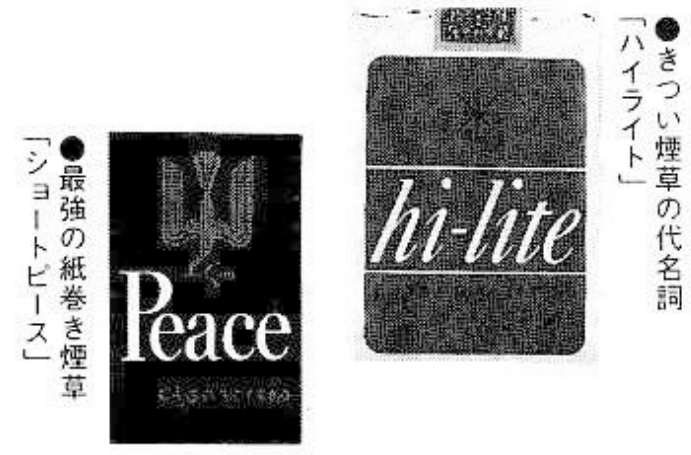

| Product Name | Harmful Ingredients | Lethal Dose | Dosage |
|-|-|-|-|
| Tobacco | Nicotine | 30～60mg(A)(B), 50～60mg(C) About 40mg(F)(G), 80～160mg(G) | Each cigarette containing 2mg nicotine 15～80 branch |

The nicotine contained in short cigarettes HOPE, HI-LITE and other cigarettes is much more toxic than generally imagined. For a baby, sometimes one or two can be fatal. Professional books describe it as "a poison comparable to cyanide".

Currently sold cigarettes, short HOPE contains 1.6 mg, HI-LITE contains 1.6mg, and short PEACE contains 2.7 mg of nicotine. It contains more nicotine than cigars, but it is ineffective due to the burning of nicotine when smoking. Of course, you can also eat the tobacco leaves, but soaking the tobacco leaves in water to dissolve the nicotine will make the absorption faster and more effective. After the tobacco leaves are soaked in water, 50-70% of the nicotine will dissolve within one hour. When you plan to ingest 60 mg of nicotine, you can soak 44 short PEACE sticks in water, since the 50% dissolved out of it would be enough. After one hour drink it. If you boil it in a pot, nearly 70-100% can be dissolved in a short time. However, heat of one hundred degrees will not destroy nicotine, and it will dissolve faster when placed in alcohol. The cigarette solution is very bitter, so adding some sugar would be a good idea.

While nicotine initially stimulates the central nervous system, such as motor nerves, it excites and then produces an inhibitory effect. Immediately after taking it, you would felt burning pain in throat, nausea, regurgitation, and headache, and soon became paralyzed and confused. Death due to respiratory arrest. After taking a lethal dose, paralysis occurs without excitement, and the person falls into a state of collapse, and will die in an instant.

The biggest problem is that nicotine has strong nauseating effects and is best taken with medication to prevent nausea. Of course, if this solution is injected into a vein, the effect is stronger and there is no need to worry about vomiting.

### Naphthalene, camphor, cockroach killer, and other insecticides

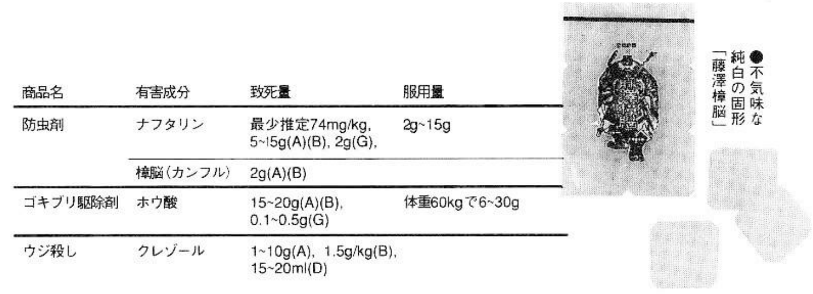

<table>
    <thead>
        <tr>
            <th>Product name</th>
            <th>Ingredients</th>
            <th>Lethal dose</th>
            <th>Dosage</th>
        </tr>
    </thead>
    <tbody>
        <tr>
            <td rowspan="2">Pesticide</td>
            <td>Camphor</td>
            <td>2g(A)(B)</td>
            <td>2～15g</td>
        </tr>
        <tr>
            <td>Naphthalene</td>
            <td>490mg/kg (rat, LD50)</td>
        </tr>
        <tr>
            <td>Cockroach Killer</td>
            <td>Boric acid</td>
            <td>15～20g(A)(B),0.1～0.5g(G)</td>
            <td>6～30g(60kg)</td>
        </tr>
        <tr>
            <td>Maggoticide</td>
            <td>Cresol</td>
            <td>1～10g(A),1.5g/kg(B),15～20ml(D)</td>
        </tr>
    </tbody>
</table>

Of course, drugs that kill worms can also be harmful to humans. There are naphthalene ball, camphor powder, etc. The amount of camphor in "Fujisawa camphor" (Fujisawa Pharmaceutical Industry) is 252 grams per box. Symptoms of poisoning include headache, vomiting, confusion, fatigue, etc., and in severe cases, drowsiness. The liver and kidneys can also be injured.

Today's insect repellents are mainly based on the relatively safe para-dichlorobenzene, while tea and camphor are gradually disappearing. Naphthalene is more toxic than camphor. Cockroach killers such as "Cockroach Killer Boric Acid Balls" and "Cockroach Killer" all contain the harmful ingredient boric acid. Boric acid inhibits the central nervous system. When taken in large amounts, symptoms such as headache, vomiting, weakness, drowsiness, and lethargy may occur, and death may occur due to circulatory insufficiency. It can also cause disorders to the kidneys and liver. If you are worried about the sequelae, you should take a large amount to prevent suicide attempts. Bleach and other chemicals also contain boric acid.

Insecticide sprays turn into liquid when sprayed into the air, making them easy to drink. Products such as "Ujitouru", "Torazouru", "Pirezooru" among pesticides are dangerous. These products contain only 1-10% of the harmful ingredient cresol, so if you don't take a certain amount, it won't be fatal. The ingredients contain 40-70% of orthodichlorobenzene. It is highly toxic, so the drug itself is quite toxic. Cresol can cause mucosal corrosion, vasoconstriction, etc. Orthodichlorobenzene can inhibit the central nervous system and stimulate mucous membranes. Both cause harm to the liver and kidneys. Taking it will cause upper digestive organ pain, sensory disturbance, lowered blood pressure, circulatory insufficiency and death.

### Organic solvents: kerosene, gasoline, benzene, thinner

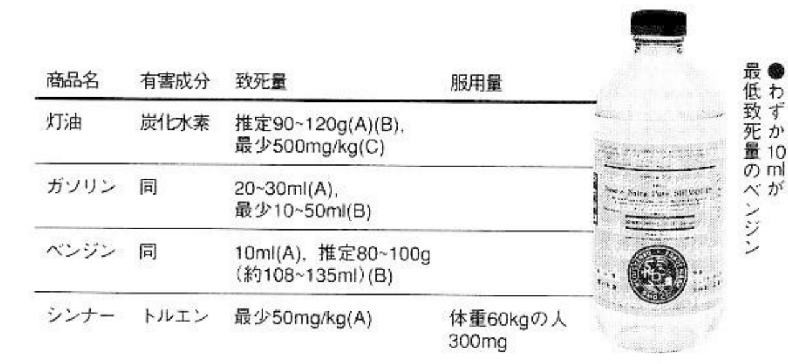

<table>
    <thead>
        <tr>
            <th>Product name</th>
            <th>Hazardous ingredients</th>
            <th>Lethal dose</th>
        </tr>
    </thead>
    <tbody>
        <tr>
            <td>Kerosene</td>
            <td rowspan="2">Multiple hydrocarbons</td>
            <td>Estimated 90～120g(A)(B), at least 500mg/kg(C)</td>
        </tr>
        <tr>
            <td>Gasoline</td>
            <td>20～30ml(A), at least 10～50ml(B)</td>
        </tr>
        <tr>
            <td>Benzene</td>
            <td>Benzene</td>
            <td>10ml(A), estimated 80~100g (about 108~135ml)(B)</td>
        </tr>
        <tr>
            <td>Thinner</td>
            <td>Toluene, methanol, etc.</td>
            <td>Minimum 50mg/kg(A)</td>
        </tr>
    </tbody>
</table>

It is also possible to pour kerosene, gasoline, etc. on the body and light it on fire, but if you take it, you can die without much pain in a small amount. Both of these will irritate the mucous membranes and inhibit the central nervous system after taking them. Nausea, drowsiness, chest burning sensation, confusion, etc. may occur, and eventually death may occur due to respiratory arrest. Sometimes there are cases of sudden death due to ventricular fibrillation. However, there have been cases of recovery after drinking 250ml of gasoline.

Benzene is readily available in pharmacies. The minimum lethal dose is 10 ml, which is equivalent to one-fifth of a glass, but at least 100 ml should be taken. But this cannot be considered a large amount. After taking it, the central nervous system is suppressed and the whole body becomes anesthetized. The first symptoms are headache, dizziness, a short-term feeling of intoxication and drowsiness, and death due to respiratory failure or sudden ventricular fibrillation. The symptoms of poisoning are not serious and are most suitable for suicide.

Inhaling the volatile components of benzene is more toxic than taking it. However, since the lethal dose of inhalation has not yet been determined, we will not introduce it. Thinner is originally a "liquid for diluting paint" and is mostly a mixture of toluene and methyl alcohol. Most of them are obtained by others, and the content of ingredients is not fixed, so they are not suitable for planned suicide, but they are very toxic. After taking it, there will be a burning sensation in the mouth, esophagus, and stomach, which will inhibit the central nervous system, damage the hematopoietic function, and lead to death.

The use of thinner is easy to cause death by inhalation. 1-3ppm can immediately cause anesthesia. Fill the washbasin with banana water and cover it with a quilt, and you will lose consciousness and die from lack of oxygen. This is the only peaceful method of suicide other than medicine. High purity diluents should be used. Of course, taking a few puffs to speed things up is a good place to start before resorting to other methods of suicide.

### Household items

#### Rust remover, iodine tincture, cresol soap, car antifreeze

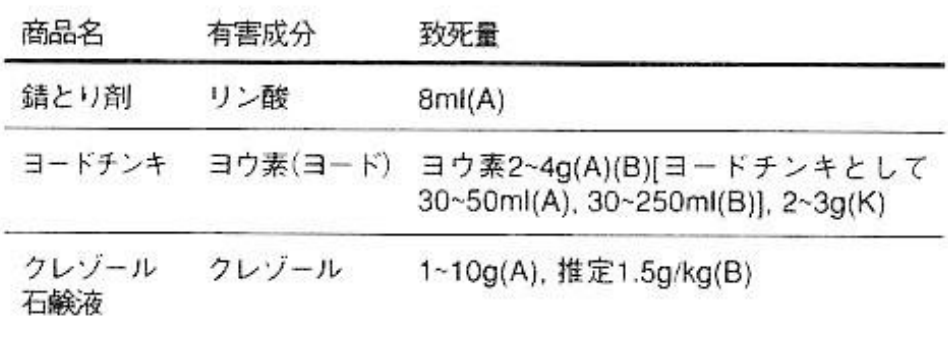

| Trade name | Hazardous ingredients | Lethal dose |
|-|-|-|
| Rust remover | Phosphoric acid | 8ml(A) |
| Iodine tincture | Iodine | Iodine 2 to 4g (A) (B), [for iodine, 30 to 50ml (A), 30 to 250ml (B)] |
| Cresol soap | Cresol | 1～10g (A), estimated 1.5g/kg (B) |
| Car antifreeze | Ethylene glycol | Acute toxicity 1.4ml/kg (human, oral) |

Rust removers such as "Clean Rust" and "Best Clean" contain approximately 40% concentration and 89% phosphoric acid. The lethal dose of herbicide is 22.5ml. If such a large amount is taken, it is not so much the toxicity of the phosphoric acid itself that causes tissue damage in the mouth, esophagus, stomach, etc., leading to acute death. Disinfectants are highly toxic and are readily available in pharmacies, making them an excellent suicide drug. Apart from medicines, there is probably nothing beyond it. A pharmacist also said: "This kind of thing is the easiest way to kill. Because you can drink it in large gulps."

Iodine can corrode digestive organs, cause headaches, confusion and shock, leading to drowsiness and death.

It is generally believed that the lethal dose of cresol for an adult weighing 60 kg is 180mg. Taking it can excite the central nervous system and then show an anesthetic effect, leading to sensory impairment and spasm, ranging from confusion, respiratory paralysis to cardiac arrest. Loss of consciousness can occur within five minutes as quickly as possible and as late as thirty minutes. It is harmful to the kidneys and liver, and the 24 hours after ingestion are critical. A 14-year-old junior high school student who fell into a coma after drinking about 80 mg of cresol regained consciousness for a time, but his liver and kidneys were damaged. Six days later, he developed a pneumothorax in which air was trapped in the lung membrane, and he died due to cardiac arrest.

The most common ingredient in today's car antifreeze is ethylene glycol. It can be directly absorbed by the human body and metabolized into a variety of substances in the human body, some of which are neurotoxic or can disrupt the material circulation in the human body, eventually causing people to die from systemic acidosis or multiple organ failure. Car antifreeze containing ethylene glycol and even pure ethylene glycol are easily available. Plus, pure ethylene glycol is sweet, which is much better than the weird taste of other things. But if you take ethylene glycol, you will die in pain.

### Cosmetics: nail polish remover, hair dye, hair perming agent

| Trade name | Hazardous ingredients | Lethal dose |
|-|-|-|
| Nail Polish | Cellosolve(cello solve) Acetone Amyl acetate| Estimated 100ml(A) Estimated 50～75ml(A)(B) Estimated 50g(A) (B) |
| Hair dye | Paraphenylenediamine | Estimated 10g(A) |
| Hair perming agent | Potassium bromate | Estimated 20g, minimum 4g (B) |

Nail polish remover is the most dangerous product in cosmetics. Containing 20%-25% of acetone and 30%-50% of amyl acetate, it has anesthetic properties. Taking a large amount will irritate the mucous membrane, causing headaches, excitement, fatigue, and even coma. The content varies from product to product, so use this table as a reference to confirm the lethal dose. If a suicide attempt fails, the liver and kidneys may be damaged.

Nail lacquer also contains 30% acetone and 30% amyl acetate. Drinking 500-750mg can reach a fatal dose. There is severe nausea, but as long as it is absorbed, there will be headache, excitement and coma. Since it is not very toxic, the disadvantage is that it must be consumed in large quantities.

Paraphenylenediamine, an ingredient in hair dye, is used to dye hair black and is extremely toxic. "Higan Colorful Hair" (Houyuu), "Paon", "Veraton", (Ero Cosmetics), etc. all contain about 2% of paraphenylenediamine. The content of powder is higher. "Paon" powder (6g in a box) contains 6%; only drinking 14g is enough. Of course, when drinking, it is better to dissolve it in water first to improve its absorption rate.

Taking large amounts can cause acute liver disorders ranging from circulatory collapse to respiratory distress to death. The second liquid neutralizer of perm solution contains 2%-6% potassium bromate (potassium bromate). Potassium bromate stimulates the central nervous system and gastric tissue, causing nausea, vomiting, stomach burning, and coma. It sometimes causes hearing impairment and is considered highly toxic. However, due to the small amount, at least 80 g is required to cause death. To be sure, you must drink one kilogram of hair perming liquid. So I'm not going to recommend it.

### Others: herbicide, aconite, salt

| Trade name | Hazardous ingredients | Lethal dose |
|-|-|-|
| Herbicides | Paraquat Adipoyl chloride Diquat | Estimated 40mg/kg(A)< br>Estimated 15ml(B) 6～12g/50kg(B) |
| Aconitum | Aconitine | 3～4mg(A)(D), plant at least 1g(A) |
| Table salt | Sodium chloride (NaCl) | Estimated 0.5~5g/kg(A) (ie 30~300g/60kg) |

Although herbicides containing paraquat are not easily available to ordinary people, they are still widely used in rural areas, so they can still be obtained. This is a highly toxic drug and the antidote is still unclear.

Paraquat and Diquat have similar structures and properties. Both of them produce enzymes in the body and deteriorate the lipids of cell membranes. Severe vomiting may occur after drinking, and the mouth, esophagus, and digestive organs may rot, harming the liver, kidneys, circulatory organs, lungs, etc., and may lead to death. The characteristic is that although the internal organs are damaged, the sensation is clear, so the pain is greater (Case study 3).

The herbicide "Gramochon" contains paraquat 24%, "Pragrocks L" and "Majiate" contain 5% paraquat and 7% diquat, "Regorox" contains 30% of diquat. The lethal dose of "Regorox" is 20-40ml. In addition, there are many herbicides containing two ingredients.

In one case, a 40-year-old woman attempted suicide after drinking about 10ml of paraquat. A 28-year-old man who drank approximately 100 ml of the herbicide "Gramochon" died of lung disease 14 days later. Similarly, a 50-year-old woman who drank 250 mg of Glamox died of circulatory failure thirty hours later. A 67-year-old man who drank about 100 mg of "Regorox" died of respiratory arrest six hours later.

In short, if you want to die early, you must drink a lot.

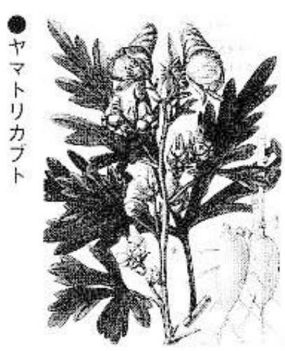

A few years ago, the plant aconitum, which attracted attention because it was used in murder cases and became a big seller, contains aconitine, which is known to be highly toxic among plant poisons. The roots contain particularly large amounts, which can irritate the body. It damages the central nervous system, peripheral nerves, heart, etc., especially the marrow, causing paralysis of the respiratory muscles, which can stop the respiratory function in about two hours. However, what ordinary florists sell is the less toxic floral aconitum. There are many species in the family of Aconitum. There's one, *Aconitum japonicum subsp. japonicum* (ヤマトリカブト) that mainly grows in the mountain forests of Honshu, and can be harvested there. In fact, some people mistakenly thought that it's a wild herb, and ate it, and was poisoned.

I would presume nobody wants to commit suicide by eating salt. However, salt can also cause death. Because it is very interesting, I will introduce it here. If you plan to commit suicide with salt, you must drink 300 grams (a cup). Someone once died after drinking a liter (about 1.8 liters) of soy sauce because the soy sauce contained about 14% salt. Symptoms of salt poisoning include dizziness, confusion, shortness of breath, fever, weakness, etc. Ingestion of large amounts salt can cause disorders in the circulatory system, liver, kidneys, etc., which can lead to fatal injuries.

At this point, you may be wondering why the commonly heard names of potassium cyanide and tetrodotoxin do not appear. This is because the current regulations on management and disposal are extremely strict and difficult to obtain, so even listing them is meaningless, so they are not listed here.

The ovaries and liver of puffer fish are highly toxic, but due to differences in the fish body and the season, the toxicity will vary to a certain extent. Even if you get it, it may not be suitable for suicide. Regarding these, drugs that are difficult to obtain and their lethal doses are tabulated at the end of this chapter. If you can get it, I hope you can use it as you see fit.

## Case study 3: A boy who died eight days after drinking paraquat

In October 1985 in Gunma County, family members returning home from an outing found a boy in the second grade of middle school (14 years old at the time) wandering around in the room holding his stomach. That morning he went out as usual, drank about 40 to 50 ml of the pesticide paraquat in the forest away from school, and then returned home. In addition to bicycles and schoolbags used for school, there were also hastily written suicide notes, traces of vomiting, medicine bottles, etc. left behind in the mountains and forests. When he was taken to the hospital, his mouth and throat were ulcerated, and his mouth bled whenever he screamed. After that, although it was quite painful, he still said "I want to eat early", "I want to read comics", "Thank you, Mom and Dad", etc. After a while, he started to say some fantasy words, "My bus has left", "The UFO is coming" and so on. Sometimes he would make such a loud noise that it would take four adults to subdue him, but he would still die eight days later.

The suicide note contained the names of three students in the same class and the words "I will always hate you even in heaven.". He was a member of the basketball team. About three months before his suicide, he was often scolded by others during practice, saying: "What are you doing!", "Don't be lazy!", etc., and he was beaten and kicked in the chest. and abdomen. After quitting in October, he was beaten behind the gym after class. The reason for his suicide was the bullying from the above.

He is a computer fanatic, reading books about computers, and also likes cartoons. A large still of Rumiko Takahashi's original work "Urusei Yatsura"[^urusei-yatsura] hangs in his room.

[^urusei-yatsura]: Urusei Yatsura (うる星やつら) is a Japanese manga series written and illustrated by Rumiko Takahashi. It was serialized in Shogakukan's Weekly Shōnen Sunday from September 1978 to February 1987. It tells the story of Ataru Moroboshi, and the alien Lum, who believes she is Ataru's wife after he accidentally proposes to her.

### Check: the cause of death

Words such as "nausea", "mucosal corrosion", and "disorder" have been used in the case report. In fact, these are the symptoms.

The lethal dose of paraquat is 15 mg. It is unknown what proportion of paraquat the pesticide the teenager drank contained. In addition to the immediate vomiting, the actual amount absorbed into the body probably reached the lethal dose. Because he was an athlete and had quite good physical strength, he lasted eight days. However, generally speaking, suicide by taking poison means that there are many cases of death in the hospital bed after several days.

This case is a boy who committed suicide due to being bullied. As he belongs to a sport with strict training and team competition, it is natural for a few guys to bully others. The exact level of violence involved is unknown, but is common. In fact, it's not just limited to club activities, it's what happens in the world.

## Table of substances that are difficult to obtain

[Translator's note: I did not check the following tables]

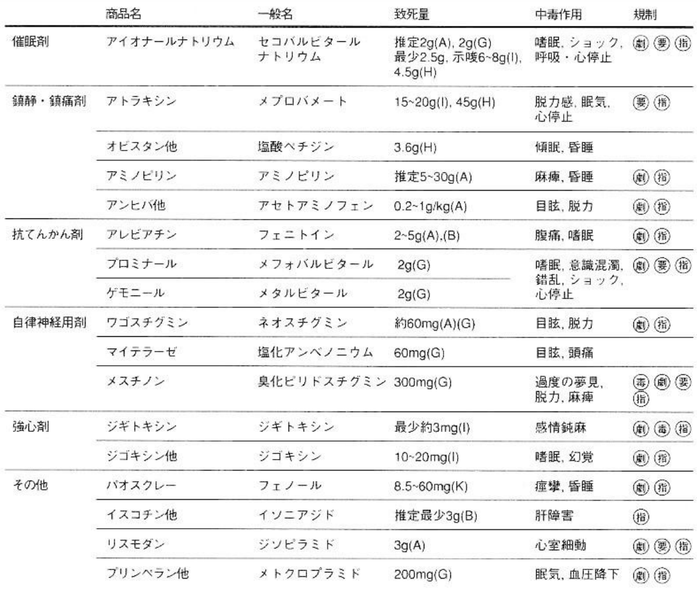

| Trade name | Common names of ingredients | Lethal dose | Poisoning reactions | Restrictions |
| - | - | - | - | - |
| Sleeping pills | Secobarbital sodium39 | Estimated 2g(A), 2g(G) At least 2.5g, implying 6~8g(I) 4.5g(H) | Drowsiness, shock  Breathing and heartbeat arrest | Drama, key, pointer |
| Sedatives, analgesics | Meprobamate40 PethidineHydrochloride41 Aminophylline42 Acetaminophen43 | 15～20g(I),45g(H) 3.6g(H) Estimated 5～30g(A) 0.2～1g/kg(A) | Fatigue, drowsiness, heartbeat stop drowsiness, drowsiness paralysis, drowsiness dizziness, weakness of limbs| To, refers to   drama, refers to  drama, refers to |
| Antiepileptic agent | Mephobarbital44 Metharbital45 | 2g(G) | Drowsiness, confusion, confusion, shock, cardiac arrest | Drama, main, refer to |
| Autonomic nervous system medication | Neostigmine46 Ammonium47 | About 60mg(A)(G) 60mg(G) | Dirty eyes and limb weakness Tight eyes, headache | Drama, refers to |
| Cardiotonic | Digitoxin48 Digoxin49 | At least about 3mg(I) 10～20mg(I) | Sluggishness Drowsiness, hallucinations| Drama, Poison, Finger Drama, Finger |
| Others | Phenol isoniazid50 | 8.5～60mg(K) Estimated at least 3g(B) | Spasm, lethargy Liver disorders | Drama, finger finger |

> 39 Secobarbital sodium: Secobarbital sodium is a barbiturate derivative drug with anesthetic, anticonvulsant, anxiolytic, sedative and hypnotic properties. It is the most commonly used drug in physician-assisted suicide in the United States.
> 
> 40 Meprobamate: Meprobamate, also known as diazepam, is a propylene glycol antipsychotic drug that has been basically replaced by benzodiazepines and has been discontinued in China.
>
> 41 Pethidine Hydrochloride: Pethidine hydrochloride, also known as pethidine, is an opioid analgesic with lower side effects and addiction than morphine.
> 
> 42 Aminophylline: Aminophylline is a compound containing the bronchodilator theophylline and ethylenediamine in a ratio of 2:1. Aminophylline is less potent and shorter acting than theophylline. Its most common use is to treat airway obstruction in asthma or COPD. Aminophylline can cause theophylline toxicity. Aminophylline has been found to reduce the sedative effects of propofol and reduce the antiepileptic effects of topiramate.
>
> 43 Acetaminophen: acetaminophen phenol, paracetamol.
> 
> 44 Mephobarbital: Mephobarbital, a barbiturate that is metabolized to phenobarbital.
>
> 45 Metharbital: A barbiturate anticonvulsant used to treat epilepsy. It has similar properties to phenobarbital. Abbott stopped selling it in 1990.
> 
> 46 Neostigmine: Neostigmine, a drug used to treat myasthenia gravis, has side effects that can cause decreased heart rate, hypotension, and weakness.
>
> 47 Ammonium: Ammonia? ? ? ? ? ?
> 
> 48 Digitoxin: Digitoxin is a cardiac glycoside. It is a plant steroid similar in structure and effects to digoxin (but with longer lasting effects).
>
> 49 Digoxin: Digoxin, commonly known as Lanoxin. It is a cardiac glycoside extracted from the foxglove plant and is widely used to treat heart disease. Side effects may include loss of appetite, nausea, visual disturbances, confusion, and irregular heartbeat. Digoxin is nephrotoxic.
>
> 50 Phenol isoniazid: Isoniazid hydrochloride, a commonly used anti-tuberculosis drug, can also be used to treat depression and has strong liver toxicity.

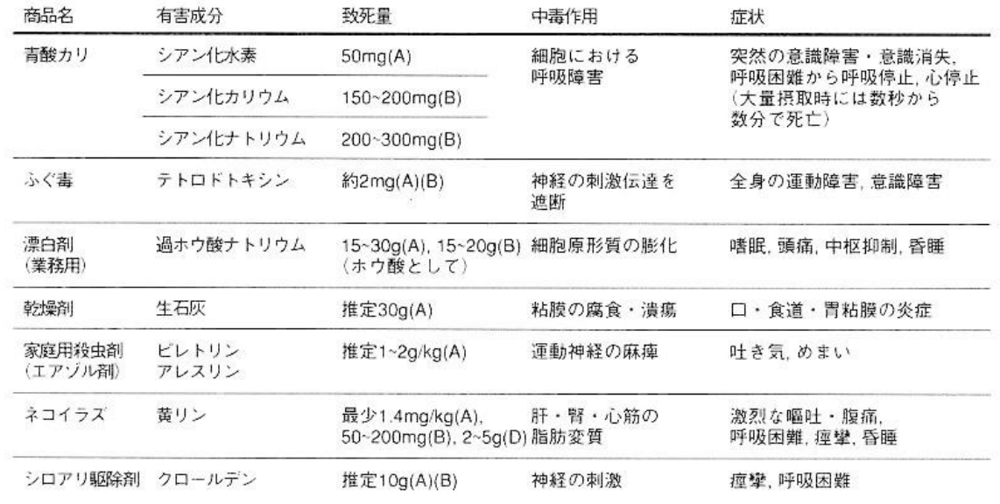

| Trade name | Hazardous ingredients | Lethal dose | Poisoning reaction | Symptoms |
| - | - | - | - | - |
| Potassium cyanide | Hydrogen cyanide51 Potassium cyanide52 Sodium cyanide53 | 500mg(A) 150 ~200mg(B) 200~300mg(B) | Cellular respiration disorder | Sudden disturbance of consciousness and loss of consciousness.  From difficulty breathing to respiratory arrest and heartbeat arrest.  (Death within seconds after ingesting a large dose) |
| Tetrodotoxin 54 | About 2mg(A)(B) | Nerve paralysis | General movement disorder, disturbance of consciousness, difficulty breathing |
| Bleaching powder (for industrial use) | Sodium perborate | 15～30g (A) 15～20g (B) (boric acid) | Cell protoplasm swelling | Drowsiness, headache, lethargy |
| Desiccant | Quicklime | Estimated 30g | Mucous membrane corrosion, ulcers | Gastrointestinal ulcers and inflammation |
| Household insecticide (spray) | Pyrethrin55 | Estimated 1～2g/kg(A) Minimum 1.4mg/kg(A) | Motor nerve paralysis | Dizziness, nausea |
| Rodenticide | Yellow phosphorus | 50～200mg(B) 2～5g(D) | Fatty degeneration of liver, kidney and myocardium | Severe vomiting, abdominal pain, dyspnea, spasm, lethargy |
| Termite killer | Chlordane56 | Estimated 10g(A)(B) | Nerve stimulation | Cramps, dyspnea |

> 51 Hydrogen cyanide: Hydrogen cyanide (HCN), a highly toxic substance.
> 
> 52 Potassium cyanide: Potassium cyanide (KCN), a highly toxic substance.
>
> 53 Sodium cyanide: Sodium cyanide (NaCN), a highly toxic substance.
> 
> 54 Tetrodotoxin: Tetrodotoxin is an extremely powerful neurotoxin. Poisoners often die from cardiac paralysis and respiratory paralysis. There is currently no specific antidote. The human LD50 is 334 μg/kg.
>
> 55 Pyrethrin: Pyrethrin, a low-toxicity pesticide that is contained in most insecticides and may cause asthma and other symptoms when ingested in large amounts.
> 
> 56 Chlordane: Chlordane, a termite killer, has potential carcinogenic effects and was banned in the United States in 1988.
